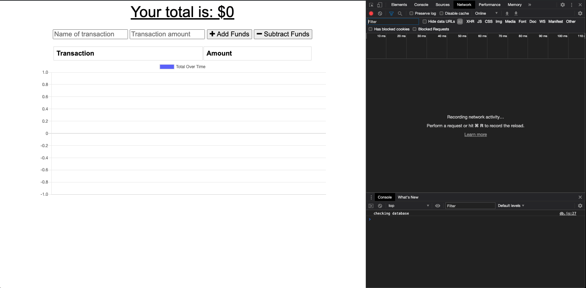
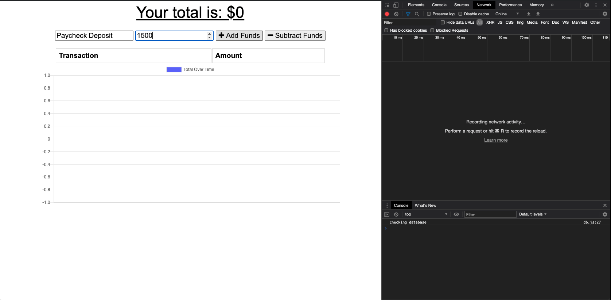
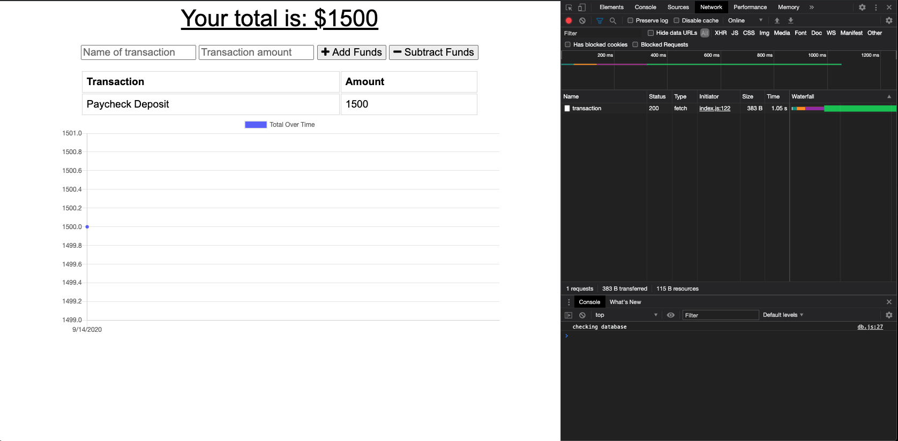
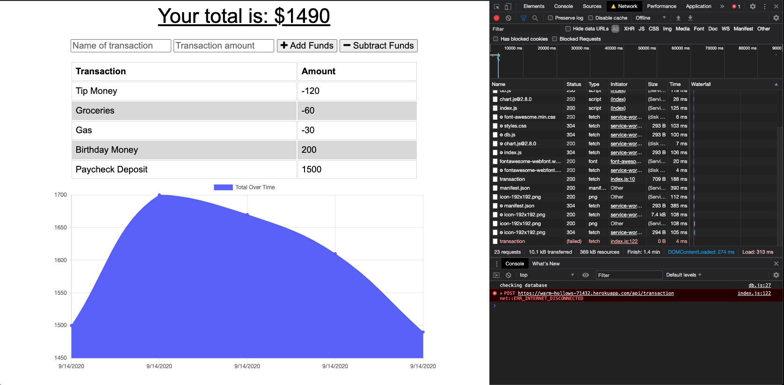

# Budget Tracker

A budget tracker that allows users to track their spending by viewing the balance of an account over time. It utilizes a Mongo database to save data. If, for any reason, a user loses their online connection, the application will save the transaction request in an offline object store, and will update the database when an online connection returns. The application is built using Express and Mongoose.

## Usage

This application is deployed on Heroku. View the application [here](https://warm-hollows-71432.herokuapp.com/).

## Testing

Download the code from the repository. Run `npm i` to import all dependencies. Start the server using `node server.js`, and visit `http://localhost:3000/` to view the application. 

## Images

* The start of the application.

* Making a transaction.

* Transaction added successfully.

* Making transaction offline, POST to database results in error. IndexedDB updated with one transaction.

* When back online upon refresh, the transaction made offline is now sent to the database after being saved in the IndexedDB. 

